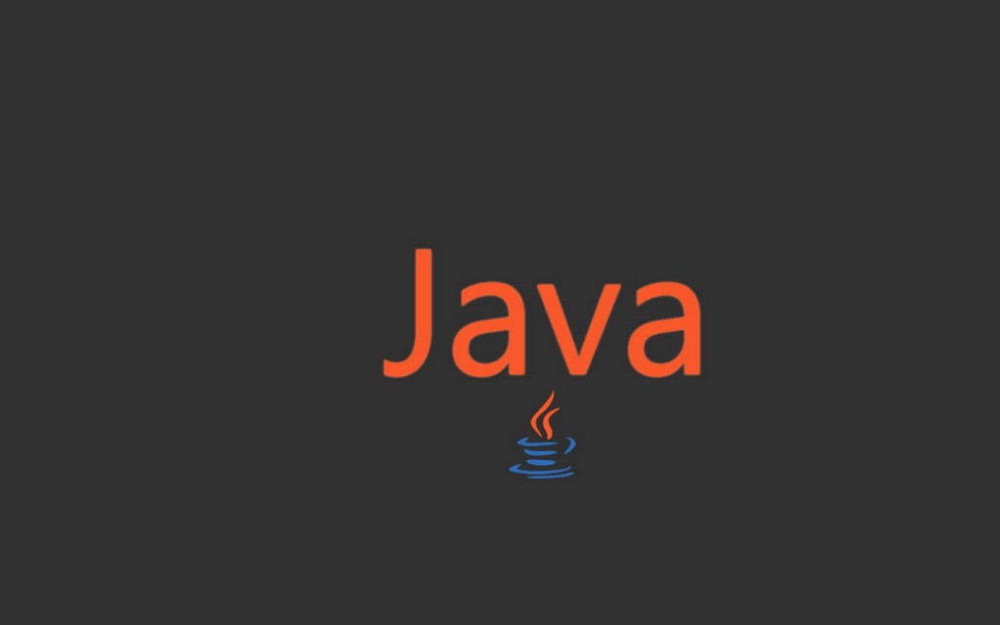

# __Объектно-ориентированное программирование__
## __на основе языка JAVA__
## __Home work 7__

# ___Итоговый проэкт!___

## __Напишите приложение:__

Которое позволяет пользователю управлять своим списком контактов. 
Используйте: 
- ___наследование___
- ___полиморфизм___
- ___принципы SOLID___

__Контрагент__ — это либо человек, либо компания.

- _У каждого контрагента есть список способов связаться:_ 
>1. телефон, 
>2. email, 
>3. ник в telegram, 
>4. адрес страницы VK, 
>5. уличный адрес.

Разрешается, что у одного контрагента сколько угодно способов связаться, 
например, несколько телефонов или несколько адресов!

- _Программа должна позволять следующие действия:_

>1. Посмотреть список контрагентов
>2. Найти контрагента по названию. Посмотреть подробную информацию о нём
>3. Добавить контрагента
>4. Удалить контрагента
>5. Добавить новый способ связаться с контрагентом
>6. Удалить способ связаться с контрагентом

__Если задача кажется слишком простой! Вы можете выбрать следующие необязательные усложнения:__
 
>1. Используйте паттерн MVC или MVP для архитектуры приложения
>2. Решите задачу на языке, отличном от Java
>3. Возможность сохранять книгу контактов в файл, загружать из файла